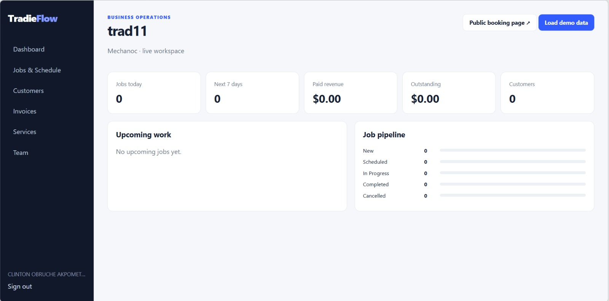

# TradieFlow

**Service Business Operations & Scheduling Platform**

TradieFlow is a full-stack operations platform designed for tradespeople and service businesses to manage customers, jobs, workers, bookings, scheduling and invoicing from one workspace.

The platform combines customer management, team scheduling, conflict detection, public booking requests, job workflows and Australian GST-aware invoicing.

## Dashboard Preview

## The Problem

Small trade and service businesses often manage customers, bookings, jobs and invoices across phone calls, messages, calendars and spreadsheets.

TradieFlow brings these workflows into one system, helping businesses manage:

- customers and service history
- incoming booking requests
- workers and job assignments
- scheduling conflicts
- job progress
- invoices and outstanding payments
- business performance

## Core Features