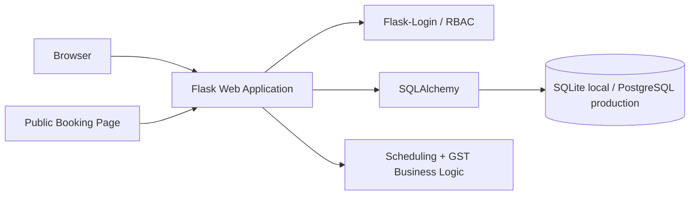

# TradieFlow v0.1

A multi-tenant-style operations SaaS MVP for Australian tradespeople and service businesses. It demonstrates tenant-scoped data, role-based workspace users, customer CRM, job scheduling, overlap detection, public booking requests and GST-aware invoicing.

## Stack
Python 3.12, Flask, SQLAlchemy, Flask-Login, Jinja, SQLite locally / PostgreSQL-compatible production configuration, Docker, pytest, GitHub Actions.

## Run locally — port 5002
```powershell
python -m venv .venv
.venv\Scripts\python.exe -m pip install -r requirements.txt
.venv\Scripts\python.exe -m flask --app app run --port 5002
```
Open `http://127.0.0.1:5002`.

If PowerShell blocks Activate.ps1, you do not need activation; the commands above invoke the virtual environment directly.

## Features
- Business registration + secure hashed-password login
- Business-scoped customers, services, jobs and invoices
- Owner/Admin/Worker roles and team accounts
- Job assignment and overlap/conflict detection
- Public customer booking URL per business
- Job status workflow: New → Scheduled → In Progress → Completed / Cancelled
- Australian 10% GST calculation with paid/unpaid invoice tracking
- Dashboard: upcoming jobs, paid revenue, outstanding invoices, customers and job pipeline
- Realistic demo seed data
- Docker + CI + tests

## Architecture


## Core relational model
`Business -> Users`, `Business -> Customers`, `Business -> Services`, `Business -> Jobs`, `Business -> Invoices`. Jobs reference a customer, optional service and optional assigned worker. Every protected query scopes records to the authenticated user's `business_id`.

## Security notes
Passwords are hashed with Werkzeug. Private records are tenant-scoped by `business_id`. Secrets are environment variables. Production work should add CSRF protection, rate limiting, verified invitations, email verification, audit logs, database migrations and stronger permission decorators per operation.

## Testing
```powershell
.venv\Scripts\python.exe -m pytest -q
```
Current tests cover GST calculation and rounding. Add scheduling conflict integration tests before production use.

## Production roadmap
1. React/TypeScript or Next.js frontend and versioned REST API.
2. PostgreSQL + Alembic migrations.
3. Full calendar UI and drag/drop scheduling.
4. Worker-specific permission policies and audit logs.
5. Stripe test-mode payments and payment webhooks.
6. SendGrid/Twilio-style notification adapters for confirmations/reminders.
7. PDF tax invoices with ABN/business details.
8. Customer portal, quotes and quote-to-job conversion.
9. Xero/MYOB integration.
10. Automated browser/API tests and observability.

## Portfolio summary
TradieFlow is an operations SaaS prototype for Australian trade and field-service businesses. It models isolated business workspaces with role-based users, customer CRM, services, job scheduling, public booking requests and GST-aware invoices. The application implements persistent relational data, authenticated tenant scoping, scheduling-conflict business logic, Australian currency/GST calculations, dashboard reporting, automated tests, CI and containerised deployment configuration.

## Resume bullets
- Developed a multi-tenant-style field-service SaaS using Flask and SQLAlchemy with business-scoped relational data and role-based workspace users.
- Implemented customer CRM, job scheduling, worker assignment and overlap detection using server-side business rules and persistent SQL data.
- Built a public booking workflow and GST-aware invoicing engine with paid/outstanding revenue reporting for Australian service businesses.
- Added automated business-logic tests, GitHub Actions CI, Docker deployment configuration and documented production hardening requirements.

## Interview questions to understand before claiming this project
1. How does `business_id` provide tenant isolation, and what additional safeguards would production require?
2. How does the overlap algorithm determine whether two jobs conflict?
3. Why are authorization and authentication different concerns?
4. How would you enforce Owner/Admin/Worker permissions consistently?
5. Why is GST calculated server-side rather than trusted from the browser?
6. How would concurrent booking requests create race conditions, and how would PostgreSQL transactions help?
7. How would you model invoice line items instead of the MVP subtotal field?
8. How would Stripe webhooks change payment state safely and idempotently?
9. How would you design email/SMS notification adapters without coupling the domain logic to one provider?
10. What changes are required to move SQLite development data to PostgreSQL production infrastructure?

## Commercialisation
Target: small Australian trades/service businesses that currently coordinate work through calls, texts, spreadsheets and calendars. A plausible validation model is free/low-cost solo tier, then paid team tiers based on users and operational features. Potential paid features: automated reminders, payments, recurring jobs, quote workflows, accounting integrations, customer portal and reporting. Validate willingness to pay with interviews and pilot users before setting final pricing. Do not treat the MVP as production-ready accounting software.
